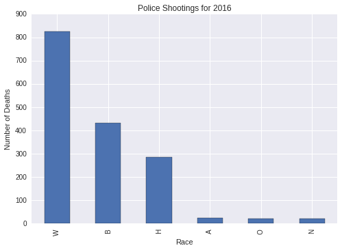
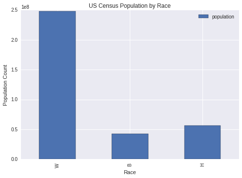
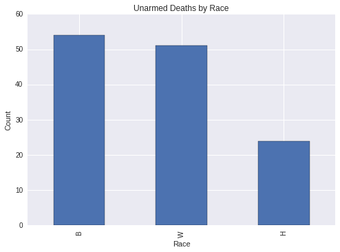
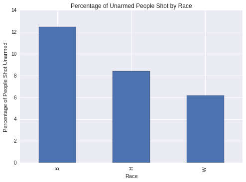
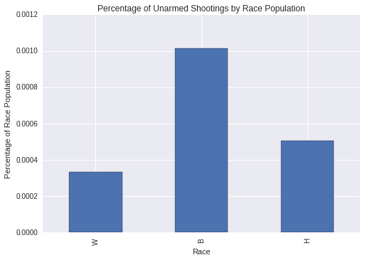

### A Quick Look At Police Shooting Data

Black Lives Matter has sparked a necessarry debate across the United States, raising questions that deserve consideration and thoughtful discussion.

In any discussion it is important for all sides to be heard, considered and addressed in a reasonable manner. Facts and arguments should be evaluated fairly on their merrits and discarded when deemed incorrect, irellevant or destructive in the context of the ongoing discussion. Things don't always work that way, especially in the echo chamber of social media.In this short analysis, I hope to bring attention to a particular course of argument that detracts from the conversation and illustrate why it should be removed from the discussion. 

The fact that more white people are shot by police than black people in the US is not statistically significant. Further, the arguments and implications that are made by parroting this statistic are at best hurtfully ignorant and at worst derisive.

For those less familiar with this statistic and the kinds of arguments made with it, below are some links to examples of this course of argument.
(**Disclaimer:** These sources can be fairly harsh. For just a quick overview of the relevant of where this statistic comes from, skip to the third link)  
[Ben Shapiro on BLM](https://www.facebook.com/subjectpolitics/videos/1740982886119264/)  
[American Thinker Article](http://www.americanthinker.com/blog/2016/07/study_cops_kill_more_whites_than_blacks_but_minority_deaths_generate_more_coverage.html)  
[Zero Hegde Infographic](http://www.zerohedge.com/news/2016-07-08/breakdown-us-citizens-killed-cops-2016)  

This analysis was conducted using the same data set that this infographic cites along with US Census data for 2016.


```python
%matplotlib inline
import numpy as np
import pandas as pd
import matplotlib.pyplot as plt
```

First, we will take a quick look at the data. There are a lot of interesting things we could look at here. However, for our purposes, we will focus on race and whether the person was armed or not. 


```python
shootings_df = pd.read_csv('./data-police-shootings-master/fatal-police-shootings-data.csv')
shootings_df.head()
```


<div>
<table border="1" class="dataframe">
  <thead>
    <tr style="text-align: right;">
      <th></th>
      <th>id</th>
      <th>name</th>
      <th>date</th>
      <th>manner_of_death</th>
      <th>armed</th>
      <th>age</th>
      <th>gender</th>
      <th>race</th>
      <th>city</th>
      <th>state</th>
      <th>signs_of_mental_illness</th>
      <th>threat_level</th>
      <th>flee</th>
      <th>body_camera</th>
    </tr>
  </thead>
  <tbody>
    <tr>
      <th>0</th>
      <td>3</td>
      <td>Tim Elliot</td>
      <td>2015-01-02</td>
      <td>shot</td>
      <td>gun</td>
      <td>53.0</td>
      <td>M</td>
      <td>A</td>
      <td>Shelton</td>
      <td>WA</td>
      <td>True</td>
      <td>attack</td>
      <td>Not fleeing</td>
      <td>False</td>
    </tr>
    <tr>
      <th>1</th>
      <td>4</td>
      <td>Lewis Lee Lembke</td>
      <td>2015-01-02</td>
      <td>shot</td>
      <td>gun</td>
      <td>47.0</td>
      <td>M</td>
      <td>W</td>
      <td>Aloha</td>
      <td>OR</td>
      <td>False</td>
      <td>attack</td>
      <td>Not fleeing</td>
      <td>False</td>
    </tr>
    <tr>
      <th>2</th>
      <td>5</td>
      <td>John Paul Quintero</td>
      <td>2015-01-03</td>
      <td>shot and Tasered</td>
      <td>unarmed</td>
      <td>23.0</td>
      <td>M</td>
      <td>H</td>
      <td>Wichita</td>
      <td>KS</td>
      <td>False</td>
      <td>other</td>
      <td>Not fleeing</td>
      <td>False</td>
    </tr>
    <tr>
      <th>3</th>
      <td>8</td>
      <td>Matthew Hoffman</td>
      <td>2015-01-04</td>
      <td>shot</td>
      <td>toy weapon</td>
      <td>32.0</td>
      <td>M</td>
      <td>W</td>
      <td>San Francisco</td>
      <td>CA</td>
      <td>True</td>
      <td>attack</td>
      <td>Not fleeing</td>
      <td>False</td>
    </tr>
    <tr>
      <th>4</th>
      <td>9</td>
      <td>Michael Rodriguez</td>
      <td>2015-01-04</td>
      <td>shot</td>
      <td>nail gun</td>
      <td>39.0</td>
      <td>M</td>
      <td>H</td>
      <td>Evans</td>
      <td>CO</td>
      <td>False</td>
      <td>attack</td>
      <td>Not fleeing</td>
      <td>False</td>
    </tr>
  </tbody>
</table>
</div>


The data set [here at the Washington Post](https://www.washingtonpost.com/graphics/national/police-shootings/). I encourage you to check this link out. It has some great interactive visualizations to play with as well as a link to the data set itself.


```python
shootings_df['race'].value_counts().plot(kind='bar')
plt.title("Police Shootings for 2016")
plt.ylabel("Number of Deaths")
plt.xlabel("Race")
```


    <matplotlib.text.Text at 0x7f6c4d4e6e80>





Here we can see that the claims made are reproducible. In terms of count, more white people than black people have been shot this year by police. However, this really only scratches the surface. We still don't know whether they were armed or not and we don't know how this compares to the total populations for each of these races.  
  
Let's start by taking a look at demographic populations as counted by the US Census. The data I am using can be found [here](http://www.census.gov/quickfacts/table/PST045215/00).

As you can see from following the link, this table contains the total US population as well as estimates for the the percent population of various demographics based on US Census Data. Since we are still dealing in raw counts, we will need to do a simple calculation to get exactly what we are looking for. 

To get the population conuts, I multiply the total population by demographic percentage then divide by one-hundred for to calculate the population counts for white, black and hispanic populations. 


```python
census_df = pd.read_csv('./census-data/demographic-populations.csv')

population_df = pd.DataFrame({
    "population" : [float(census_df['UNITED STATES'][1]) * float(census_df['UNITED STATES'][15]) / 100,
                    float(census_df['UNITED STATES'][1]) * float(census_df['UNITED STATES'][17]) / 100, 
                    float(census_df['UNITED STATES'][1]) * float(census_df['UNITED STATES'][27]) / 100]},
     index = ["W", "B", "H"])  

population_df.plot(kind = "bar")
plt.title("US Census Population by Race")
plt.ylabel("Population Count")
plt.xlabel("Race")
```


    <matplotlib.text.Text at 0x7f6c4a714240>





Here we can see that the story we started with is changing considerably. It is much less surprising that more white people are shot by police when consider that there are five times as many white people as there are black or hispanic people.

Going further, there is a greater difference between the size of these populations when compared to police shootings.

Let's take a look at what percentage of each of these groups was shot by police in 2016. 

To get the percentage of each group, I divide the count of police shootings by race by the total population and multiply by one hundred.


```python
shootings_by_population = shootings_df["race"].value_counts()[0:3]/population_df["population"] * 100

shootings_by_population.plot(kind = "bar")
plt.title("Percentage of Police Shootings by Race Population")
plt.ylabel("Percentage of Race Population")
plt.xlabel("Race")
```


    <matplotlib.text.Text at 0x7f6c4a725e80>


The good news for everyone is that **the odds of being shot by a police officer are generally statistically low**. So don't be afraid to wave, smile or give a friendly nod to the next police officer you see.  

However, what is troubling is that that **black and hispanic people face a higher risk of being involved in a police shooting**, despite making up a relatively small part of the total US Population. **Especially black people, who are almost three times as likely to be involved in a police shooting.**

So far, we've ignored whether these people were armed or not. This is an important consideration that needs to be accounted for in our analysis since there are many possible scenarios that may necessitate the use of deadly force.


```python
shootings_df['armed'].value_counts().head()
```


    gun             962
    knife           251
    unarmed         136
    vehicle          98
    undetermined     73
    Name: armed, dtype: int64


Generally speaking, it appears that less than 1 in 10 of police shootings result in the death of unarmed citizens. Which is probably pretty good.

I'm a little torn on this one, as there are some very strange and concerning cases. Such as a person listed as armed with a "stapler"... However, corner cases aside, we can say with some certainty that in majority of these cases, the police acted with probable cause. 

Now lets take a look at what happens when we filter our police shootings to only include unarmed citizens.


```python
unarmed_df = shootings_df[shootings_df["armed"] == "unarmed"]

unarmed_df["race"].value_counts()[0:3].plot(kind = "bar")
plt.title("Unarmed Deaths by Race")
plt.ylabel("Count")
plt.xlabel("Race")
```


    <matplotlib.text.Text at 0x7f6c4a647080>





From this graph we can see that the number of unarmed people killed in police shootings are much closer than the number of people killed in shootings in general and favors black people by a small margin. Similar to the first graph that we looked at, the count can't tell us the full story. Remember, the population of white people shot by the police and the general white population greatly outnumbers these two groups. 

To fully understand the differences here, we should look at what percentage of shooting deaths were unarmed in each group. To do this, I will take the number of unarmed people shot divided by the number of people shot in total times one-hundred, for each ethnic group.


```python
percentage_shootings = unarmed_df["race"].value_counts()[0:3]/shootings_df["race"].value_counts()[0:3] * 100

percentage_shootings.plot(kind = "bar")
plt.title("Percentage of Unarmed People Shot by Race")
plt.ylabel("Percentage of People Shot Unarmed")
plt.xlabel("Race")
```


    <matplotlib.text.Text at 0x7f6c4a71feb8>





Again, we see a troubling trend here. **The percentage of unarmed people killed in police shootings is disproportionately higher for black people and hispanic people than it is for white people**, despite these two groups making up less of the total shootings. **In the case of the black population the percentage of unarmed shootings is twice that of the white population.**

This gap is even larger if we look at the number of unarmed people shot by police officers compared to the total population...


```python
unarmed_by_population = shootings_df["race"].value_counts()[0:3]/population_df["population"] * 100

unarmed_by_population.plot(kind = "bar")
plt.title("Percentage of Unarmed Shootings by Race Population")
plt.ylabel("Percentage of Race Population")
plt.xlabel("Race")
```


    <matplotlib.text.Text at 0x7f5f1127cbe0>





When we look at the percentage of total demographic populations we can see that the percentage of unarmed black people killed is now closer to three times that of the white population. 

Frome this, I hope that you can see that the statistical fact that more white people are killed every year by police is only true in the most superficial sense. The reality is that a considerably greater percentage of unarmed black people were killed in police shootings this year. **These are the numbers we should be looking at and working to change.** 

Also let me know if something is not clear here and I can try to add better explanations.
